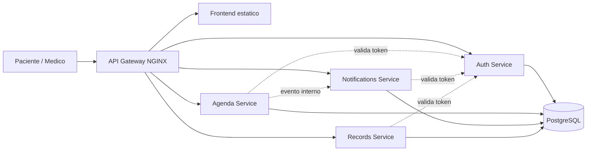
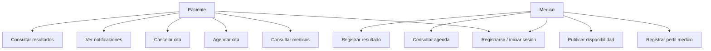
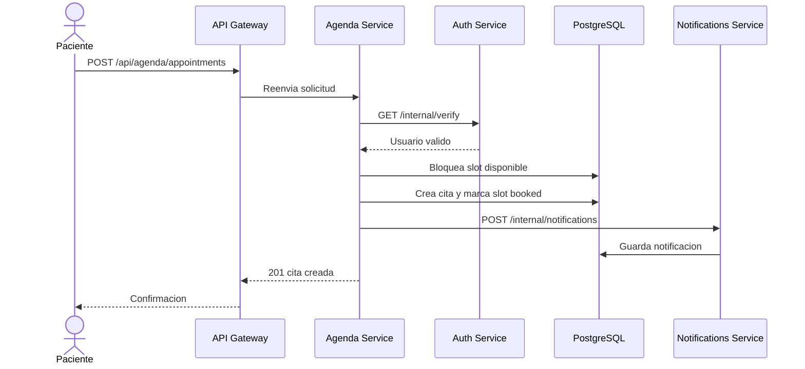

# MediReservas - Informe tecnico

## Portada

**Proyecto:** MediReservas  
**Arquitectura asignada:** Microservicios  
**Aplicacion:** Plataforma de Reservas para Consultas Medicas  
**Version del MVP:** 1.0  

## Descripcion del problema

Las clinicas pequenas suelen coordinar citas por telefono o mensajeria, lo que provoca doble reserva de horarios, baja trazabilidad, dificultad para que los medicos administren su disponibilidad y poca visibilidad para el paciente sobre el estado de su cita. MediReservas centraliza el proceso sin acoplar todos los modulos en una sola aplicacion.

## Alcance del MVP

El MVP permite registrar usuarios con rol de paciente o medico, iniciar sesion, listar medicos, publicar horarios disponibles, agendar citas, cancelar citas, emitir notificaciones internas y registrar resultados basicos de consulta. No incluye pagos, videollamadas, recetas digitales certificadas ni integracion con sistemas hospitalarios externos.

## Requerimientos funcionales

1. El sistema debe permitir registro e inicio de sesion de usuarios.
2. El sistema debe diferenciar roles de paciente, medico y administrador.
3. El medico debe poder registrar o actualizar su perfil profesional.
4. El medico debe poder publicar bloques de disponibilidad.
5. El paciente debe poder consultar medicos y horarios disponibles.
6. El paciente debe poder agendar una cita en un horario disponible.
7. El paciente o medico debe poder cancelar una cita.
8. El sistema debe generar notificaciones internas al agendar o cancelar citas.
9. El medico debe poder registrar resultados de consulta.
10. El paciente debe poder consultar sus resultados.

## Requerimientos no funcionales

- **Modularidad:** cada dominio se implementa en un servicio separado.
- **Disponibilidad local:** el sistema debe ejecutarse con Docker Compose.
- **Seguridad:** los endpoints protegidos requieren token de autenticacion.
- **Trazabilidad:** las citas y notificaciones guardan fecha de creacion y estado.
- **Escalabilidad:** cada servicio puede escalarse de forma independiente.
- **Mantenibilidad:** los contratos HTTP separan responsabilidades entre servicios.
- **Consistencia:** la reserva de citas bloquea el horario con transaccion SQL.

## Arquitectura y diagramas

La solucion usa un API Gateway con NGINX como punto de entrada. El gateway enruta llamadas a cuatro microservicios: autenticacion, agenda, notificaciones e historial/resultados. Los servicios exponen APIs HTTP y usan PostgreSQL para el MVP. Aunque comparten una instancia de base de datos por simplicidad de despliegue local, cada servicio es propietario de sus tablas.

### Diagrama de arquitectura general



### Diagrama de casos de uso



### Diagrama de secuencia: agendar cita



## Stack tecnologico

- Node.js 20
- Express
- PostgreSQL 16
- NGINX
- Docker y Docker Compose
- HTML, CSS y JavaScript para la interfaz del MVP

## Modelo de datos

- **auth_users:** usuarios, credenciales, rol.
- **agenda_doctors:** perfil profesional del medico.
- **agenda_availability_slots:** bloques de disponibilidad.
- **agenda_appointments:** citas entre paciente y medico.
- **notification_messages:** notificaciones internas.
- **record_results:** resultados o notas de consulta.

## Contratos de API

El contrato OpenAPI se encuentra en `docs/openapi.yml`. Los endpoints estan agrupados por dominio: Auth, Agenda, Notifications y Records.

## Decisiones tecnicas y trade-offs

- Se usa NGINX como API Gateway porque simplifica el punto de entrada y permite ocultar puertos internos.
- Se usa comunicacion HTTP sincrona para mantener el MVP simple y facil de demostrar. En una version productiva, las notificaciones podrian emitirse con un broker como RabbitMQ o Kafka.
- Se usa una sola instancia PostgreSQL local con tablas por dominio. Esto reduce complejidad de despliegue para el curso, aunque en produccion cada microservicio deberia tener su propia base de datos o esquema aislado.
- Se implementa autenticacion con token firmado y verificacion centralizada en Auth Service. Esto evita duplicar logica de seguridad en los demas servicios.
- La reserva de citas usa transaccion y bloqueo de fila para prevenir doble reserva del mismo horario.

## Evidencia del sistema

Al ejecutar el proyecto se puede evidenciar:

1. Pantalla de inicio de sesion y registro.
2. Listado de medicos.
3. Publicacion de disponibilidad desde cuenta de medico.
4. Reserva de cita desde cuenta de paciente.
5. Cancelacion de cita.
6. Notificaciones internas generadas por el servicio de agenda.
7. Registro de resultados medicos por el medico.
8. Consulta de resultados medicos por el paciente.

Las capturas de pantalla para el PDF pueden tomarse desde `http://localhost:8081` despues de levantar los contenedores.

## Instrucciones de ejecucion

```bash
cp .env.example .env
docker compose up --build
```

Abrir `http://localhost:8081`.

Para validar el flujo completo por API:

```powershell
.\scripts\smoke-test.ps1
```

Usuarios demo:

| Rol | Correo | Contrasena |
|---|---|---|
| Medico | `ana.doctor@demo.com` | `Demo123!` |
| Paciente | `luis.paciente@demo.com` | `Demo123!` |

## Conclusiones

MediReservas demuestra una separacion clara de responsabilidades por dominio, un gateway unico de entrada, comunicacion entre servicios y persistencia transaccional para el flujo critico de agendamiento. La solucion es lo bastante pequena para ejecutarse localmente, pero conserva decisiones arquitectonicas propias de microservicios reales.
